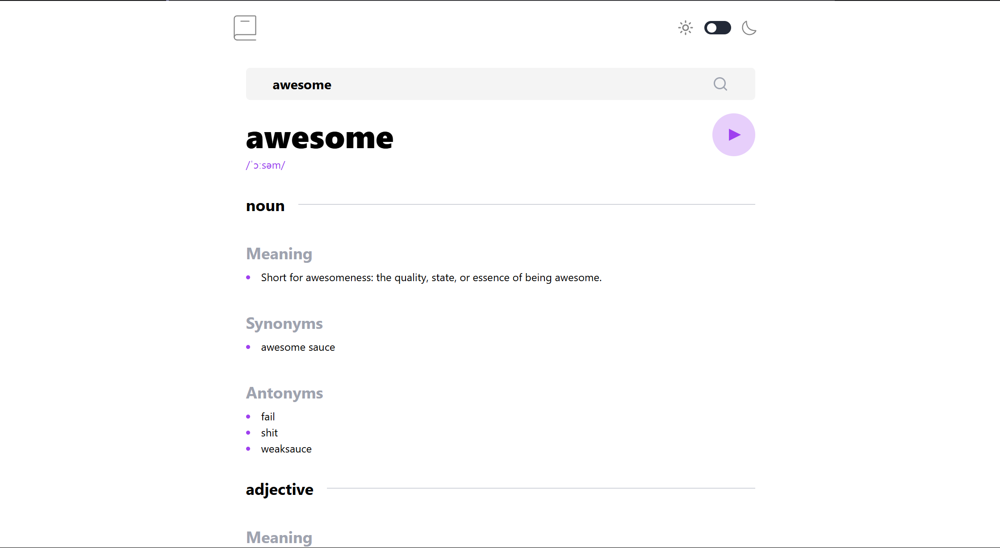

# 📖 WordHub

WordHub is a **modern and elegant dictionary app** built with **React**, **Vite**, and **TailwindCSS**. It allows users to effortlessly search for **word definitions, synonyms, antonyms, and pronunciations**, providing a smooth and intuitive user experience.

## 🚀 Live Website

🔗 [WordHub](https://word-hub-cyan.vercel.app/)

## 📸 Screenshots

| Dark Mode                          | Light Mode                          |
| ---------------------------------- | ----------------------------------- |
|  |  |

---

## 🚀 Features

✅ **Instant Word Search** – Get definitions, synonyms, antonyms, and pronunciation in real-time.  
🌙 **Dark/Light Mode** – Seamlessly switch between themes for a comfortable reading experience.  
🔊 **Pronunciation Audio** – Listen to the correct pronunciation of searched words.  
⚡ **Lightning-Fast UI** – Powered by **React + Vite** for a smooth and responsive user experience.  
📡 **API Integration** – Fetches data from a reliable **Dictionary API** for accurate results.  
📱 **Mobile-Friendly** – Fully responsive design for seamless usage on all devices.

---

## 🛠️ Tech Stack

- **Frontend**: React + TypeScript
- **Build Tool**: Vite
- **Styling**: TailwindCSS
- **Data Source**: Dictionary API

---

## 📦 Installation & Setup

Follow these simple steps to set up WordHub locally:

### 1️⃣ Clone the Repository

```sh
git clone https://github.com/your-username/wordhub.git
cd wordhub
```

### 2️⃣ Install Dependencies

```sh
npm install
```

### 3️⃣ Start the Development Server

```sh
npm run dev
```

🚀 Open [http://localhost:5173](http://localhost:5173) in your browser to explore WordHub!

---

## 🚀 Build & Deployment

To create a production build:

```sh
npm run build
```

To serve the production build:

```sh
npm start
```

---

## 🤝 Contribution

We welcome contributions! If you have any ideas for improvements or bug fixes, feel free to:

- **Fork** the repository
- **Create a new branch**
- **Submit a pull request** 🚀

Your contributions help make WordHub even better! ❤️

---

## 📜 License

**MIT License** © [Advay Sanketi](https://advay-sanketi-portfolio.vercel.app/)

---

💡 _Made with passion to enhance your vocabulary!_ 🚀
